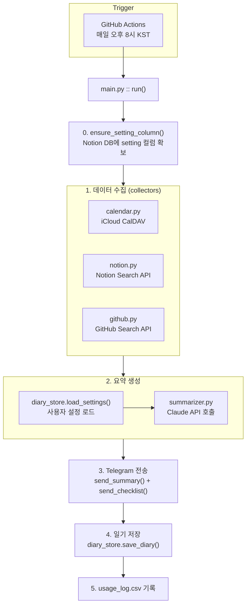
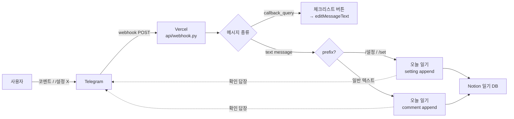
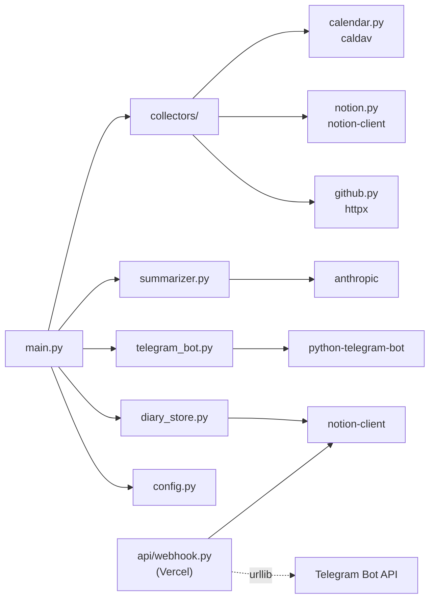
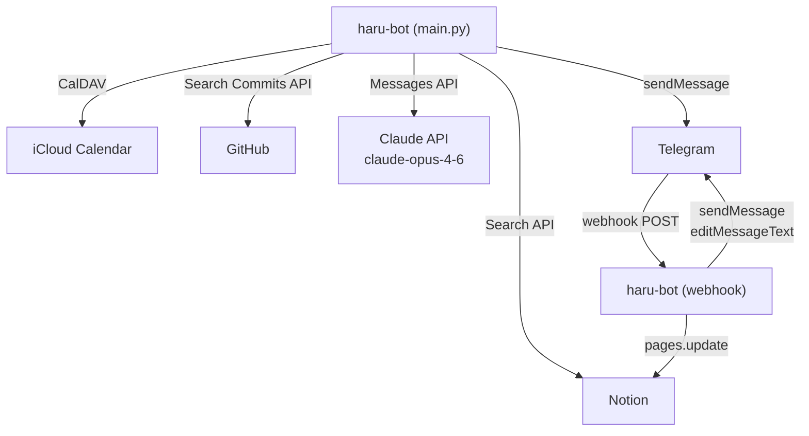
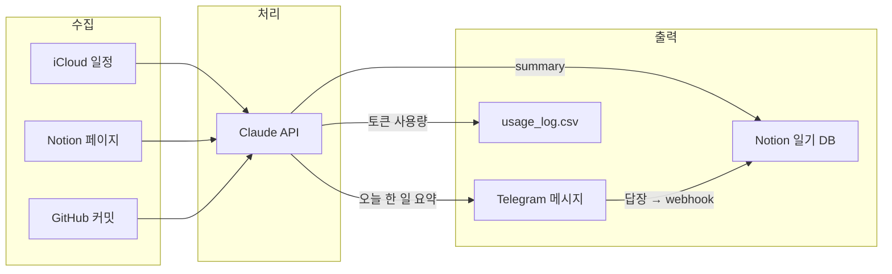

# haru-bot Architecture

## 전체 파이프라인

매일 실행되는 `main.py`는 한 방향(수집 → 요약 → 전송 → 저장)으로만 흐른다.
사용자 답장은 Vercel webhook(`api/webhook.py`)이 비동기로 받아 직접 Notion에 반영한다.

## 사용자 답장 흐름 (비동기)

## 모듈 의존 관계

## 외부 서비스 연동

## 데이터 흐름

